# Blitzkrieg 2 original 3D art style

Blitzkrieg 2 (BK2) is a 2005 RTS whose units combine economical geometry with richly described, low-resolution surfaces. The style is slightly exaggerated but mechanically believable: recognizable vehicles, strong separation of parts, earthy colors, and small painted details that remain legible from the game camera.

The existing project notes describe models commonly using roughly 100-1000 polygons, textures commonly starting at 128×128 and reaching 1024×1024 for some large assets, and an original Alias Maya 4.5 workflow. The examples collected here are a narrower reference set: all individual texture images are 128×128 except the *gt2* intact/destroyed pair, which is 512×512.

**How to use this guide:** match the supplied images first, then use the descriptions and prompts to explain what to reproduce. The texture analysis below describes visible features. The proposed painting workflow is a way to achieve those features, not a verified account of the original artists' tools, brushes, or layer stacks. A finished bitmap cannot establish whether a particular mark came from hand painting, a photograph, a procedural layer, or a bake.

## Unit appearance and faction palettes

The screenshots show how the textures read on models at RTS viewing distance. Their lighting affects color and contrast, so use the flat texture examples for paint colors and the screenshots for the overall balance of shapes and details.

### German units

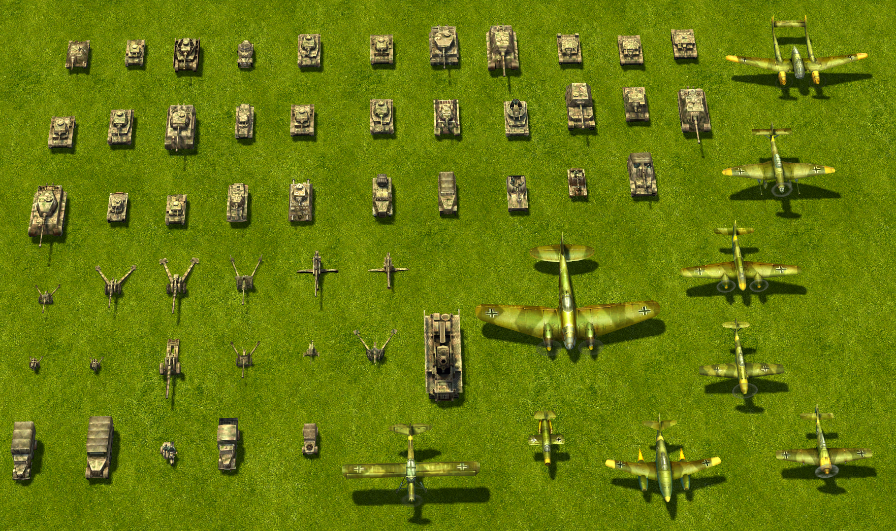

The ground vehicles tend toward dusty beige, gray-brown, and subdued olive camouflage. Pale hatches and plate edges stand out against dark wheels and recesses. Aircraft in this screenshot use greener and browner surfaces, larger wing panels, and bright identification accents; do not automatically transfer the tank camouflage to them.

### British units

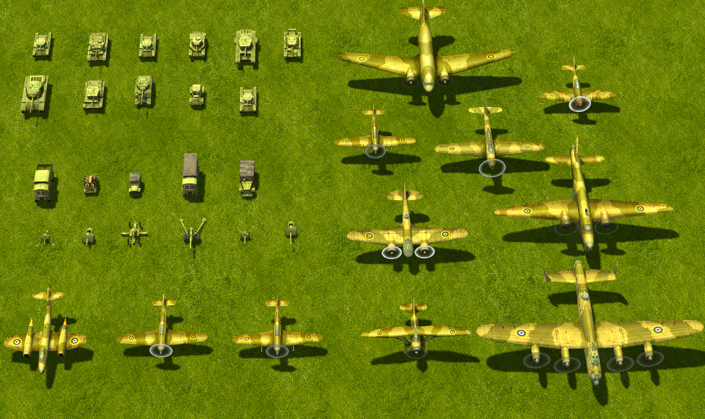

The ground vehicles have a distinctly yellow-green/olive cast, with conspicuously light upper surfaces and fittings. The aircraft read more tan, ochre, and brown-green, with broad camouflage areas and clear roundels. The supplied British ground-equipment textures are particularly useful examples of painted edge highlights.

### Japanese units

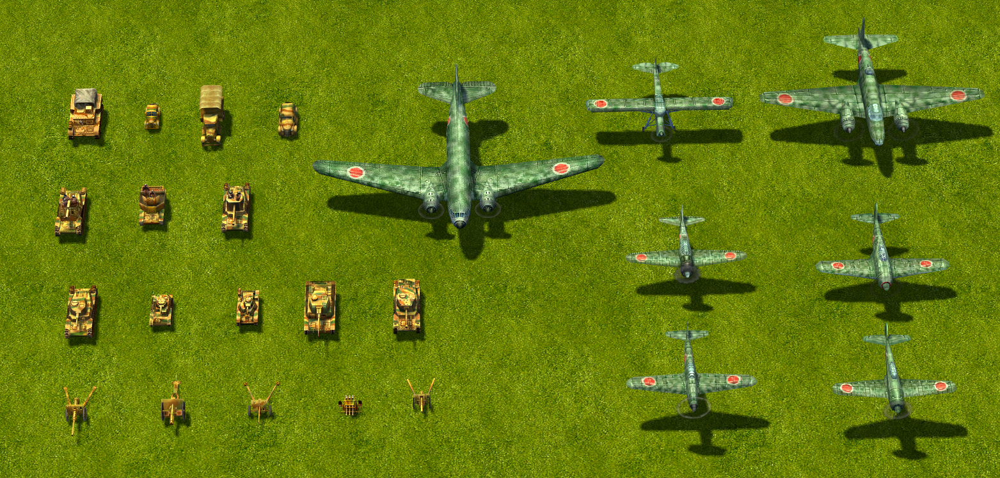

The ground vehicles show warm ochre and brown with contrasting green camouflage. Aircraft have a cooler green-gray appearance and prominent red roundels. This contrast between ground and air units is part of this reference screenshot.

### American units

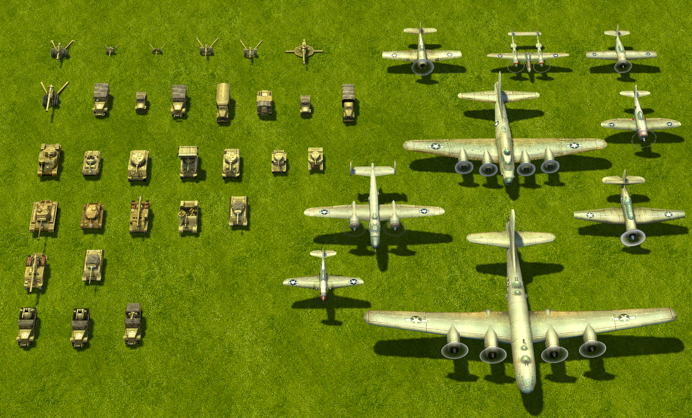

Ground vehicles read as khaki/olive with pale dusty upper details and dark running gear. Many aircraft have light gray or silvery-looking surfaces, restrained panel lines, and clear national markings. Their apparent brightness includes the scene lighting.

### Soviet units

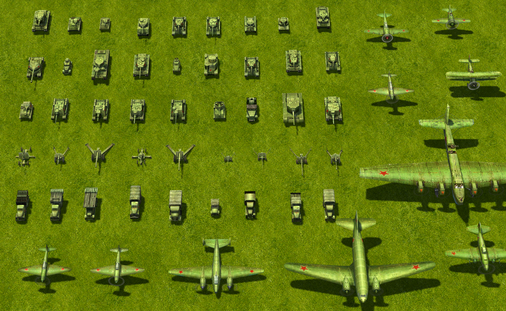

The vehicles read as a more uniform green/olive family, with lighter green fittings and dark undersides. Aircraft also emphasize green, with red stars as strong accents.

These are descriptions of the supplied examples, not universal faction or historical camouflage rules. Only German and British flat texture atlases are included below; material and brush-level claims for the other factions would need equivalent texture references.

## How to read the texture examples

A **texture atlas** is one image containing the flattened surfaces of several model parts. Each separate patch mapped onto the model is a **UV island**. A rectangle might wrap around a barrel, while a narrow strip might cover a track. Parts next to one another in the image need not touch on the vehicle, and their orientations may differ.

The black gaps between islands are not a paint scheme. Some dark areas *inside* islands already exist on intact textures, possibly representing recesses, hidden surfaces, or shadows beneath another part. In particular, a black circle is not automatically a blast hole.

The flat maps contain both surface color and painted light/dark modeling. In this guide, **value** means how light or dark a color is. The maps visibly include highlights and shadows; they are not lighting-free material-color references.

For close inspection, enlarge a 128×128 image to 512×512 using **nearest-neighbor** scaling: each original pixel becomes a 4×4 square, with no invented detail. Also inspect the original at 100% and on the model. The enlarged view explains the construction; the native/game-size view decides whether it works. AI enhancement can invent scratches and rivets, so it is unsuitable as evidence of what the original contains.

## What makes the textures look like BK2

### Soft paint underneath, crisp construction details above

The most useful description is **softly mottled military paint with selectively sharp mechanical accents**. Broad surfaces have blended tonal variation. Hatches, seams, grille bars, wheel rims, rivets, and markings interrupt that softness with small, high-contrast shapes.

There are three useful scales to reproduce:

- **Large:** the base paint/camouflage, lighter upper-facing areas, darker side/underside areas, and broad shadows around major fittings.
- **Medium:** plate borders, hatch rings, straps, vents, wheel faces, and patches of grime. These explain how the vehicle is assembled.
- **Small:** isolated bright/dark pixels, rivet rows, short tread marks, tiny chips, and faint grain. These enrich the larger shapes.

Do not give all three scales equal contrast. A rivet should support a plate, and the plate should support the vehicle's form. A texture made only of tiny scratches will miss the broad shading that gives these examples their volume.

The result can resemble pixel art in its smallest details, but the surfaces also use blended gradients, soft camouflage boundaries, and many intermediate colors. Deliberately reducing everything to hard pixel clusters or a tiny indexed palette would change the look.

### Earthy color, with a clear range of light and dark

The German ground textures combine gray-beige/sand, muddy brown, and subdued green. The British ground textures lean toward mustard olive and yellow-green, with pale yellow-green highlights and brown-olive shadows. Neither family is just a single color with black noise added.

Most painted surfaces stay in the middle of the brightness range, while selected fittings are much lighter and grilles, gaps, and running gear can approach black. Preserve this range: making everything equally muted produces a flat, muddy model. The British examples in particular need their noticeably pale details.

Highlights generally remain related to the local paint color: beige over sandy paint, pale yellow-green over olive, and gray on tire or exposed-metal details. Treat faction colors as relationships to match against a reference, not as one universal hexadecimal color.

### Painted shading that makes small parts read as three-dimensional

Much of the apparent depth is already visible in the flat image:

- **Plate edges and hatches:** a narrow pale edge beside a dark seam suggests thickness or a small bevel. Some edges are softly brightened across several pixels; only the strongest accents need to be sharp.
- **Raised fittings:** a bright face or spot with an adjacent dark mark suggests a bolt, handle, or hinge. At 128×128, a tiny bright/dark pair can communicate more than a carefully drawn miniature bolt.
- **Barrels and other cylinders:** a broad light stripe runs along the length, with darker bands toward the sides. Crosswise bands describe collars or joints. The British *gba1* example shows this especially clearly.
- **Wheels:** a pale partial rim and a few hub marks sit within a dark disk or strip. These are simplified cues, not fully modeled tire diagrams.
- **Contacts and recesses:** soft dark halos or bands around mounted parts make them sit on the surrounding surface. Some intact atlases contain very strong dark patches beneath larger assemblies.

Match the highlight direction to the part as it appears on the model. UV islands can be rotated, so “put the highlight at the top of every rectangle in the atlas” is not a reliable rule. Keep the painted shading broad enough to work alongside the game's lighting. In BK2, textures use bilinear scaling.

### Uneven surfaces, without covering everything in damage

The intact examples have dusty, slightly speckled, sometimes cloudy surfaces. The German examples show subdued mottling within and across camouflage colors. Several British plates have a fine stippled or faintly crosshatched appearance. The images alone do not reveal how much of that fine pattern came from painting, resizing, or texture processing.

A useful reconstruction is a gently varied base color, broad low-contrast cloudy patches, and finer restrained grain. Let this variation sit beneath the mechanical details. Keep some panels comparatively quiet, especially around important rivet rows and markings.

Wear is selective. Darker buildup near recesses and lower parts, faded patches on broad surfaces, and a few pale edge marks are more characteristic of the intact references than dense bright scratch networks. Avoid treating every pale edge as exposed bare metal; many are simply painted form highlights.

### Camouflage belongs to the surface

In *gt1*, *gt3*, and *gt4*, muted green shapes snake, branch, or loop over a sandy/brown base. Their boundaries are softened and irregular, while the camouflage remains large enough to read on a small vehicle. *gt2* shows a related subdued sandy/green treatment at higher resolution.

The camouflage passes beneath hatches, vents, and their highlights. Those fittings remain readable where they cross a color boundary. Paint broad camouflage shapes first, then restore the structural shading over them. Avoid filling each panel with unrelated random spots.

The British ground examples here rely more on a shared olive/yellow-green finish and panel shading than on conspicuous multi-color camouflage. Aircraft in the screenshots use their own larger patterns and panel treatment.

### Material cues are compressed into a few marks

| Surface | Visible cues to reproduce |
| --- | --- |
| Painted armor and sheet metal | Broad color fields, gentle mottling, pale selected edges, dark seams, simple fittings. Keep a solid plate feeling beneath the grain. |
| Tracks and wheel assemblies | Very dark strips and wheel disks, repeated short light tread/rim marks, brown-gray grime. The overall dark mass matters more than each individual tread. |
| Rubber tires | Charcoal gray sides, a subdued lighter rim or tread edge, and a small contrasting hub; see *gba1* and *gba2*. |
| Grilles and vents | A dark rectangle with a few regular pale bars, dots, or checker-like marks. The spacing needs to survive the final resolution. |
| Canvas covers, visible in screenshots | Broad soft light/dark folds and muted gray-brown or olive color. Fine woven fabric detail is not established by these screenshots. |
| Aircraft skins, visible in screenshots | Larger smooth areas, thin panel divisions, broad form highlights, camouflage or light metal-like color, and readable insignia. Use aircraft references when reproducing these. |

## Annotated texture examples

Each pair shows the **intact texture first** and its **destroyed variant second**. Descriptions refer to the flat images; filenames are used as reference identifiers rather than as claims about a specific vehicle model.

### German: gt1 — subdued camouflage and dense fittings

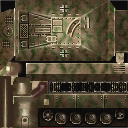 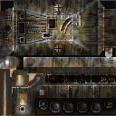

The base is dark, muddy beige-brown with low-contrast olive camouflage. The upper plate carries dense cream-colored hatch borders, grille marks, and small fittings. The wheel row sits in a nearly black band; each wheel gets only a few pale rim/hub marks. Soft halos around the fittings make the otherwise flat plate appear raised and worn.

The destroyed version keeps the layout and much of the camouflage, adding gray edge streaks, blackened bands, and brown discoloration. It becomes darker and more vertically streaked across several large islands.

### German: gt2 — higher-resolution reference for the same ideas

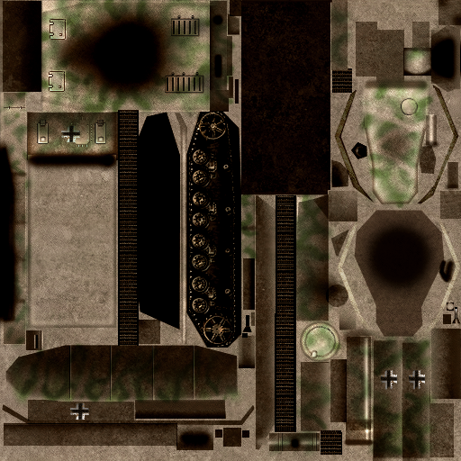 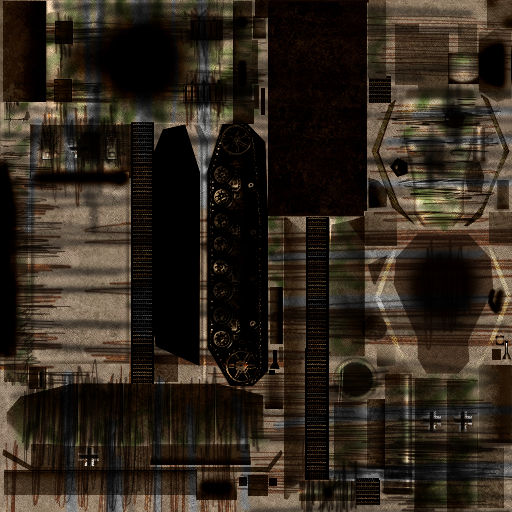

This pair is 512×512. It reveals fine sandy grain, subdued green camouflage, thin outlined panels, small grille slots, and more detailed wheel hubs. Some broad faces are comparatively plain and gray-beige. Strong soft black patches are already present on the intact map, so they must not all be interpreted as destruction.

The destroyed map adds long dark, brown, and gray streaks across panels while retaining their basic arrangement. Use this pair to study layering, but do not require its fine detail density from a 128×128 atlas.

### German: gt3 — pale dusty paint and looping green camouflage

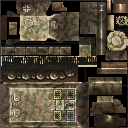 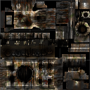

Pale gray-beige plates are crossed by soft, irregular green loops and bands. Rectangular grilles use small dark/light grids. Hatch rims and boundaries are much sharper than the camouflage. A broad shadowed wheel strip provides a dark base beneath the lighter bodywork.

The destroyed map introduces near-black patches at several fittings, darkened wheel areas, brown burn discoloration, and pale gray streaks extending from panel boundaries. The remaining pale camouflage fragments keep it related to the intact version.

### German: gt4 — strong plate edges and simple wheel symbols

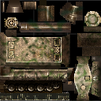 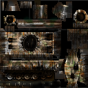

The sandy finish and winding olive camouflage are similar to *gt3*. Large plates have soft internal shading and selectively bright borders. Small circular parts use pale rings around muted centers. The wheel row is reduced to dark disks with light, broken arcs rather than complete high-detail circles.

The destroyed texture emphasizes black circular areas, gray-white scraped-looking bands, and rusty brown streaks. Several light panel edges survive, keeping the vehicle's construction readable through the darkening.

### British: gbt1 — bright hatch rims over warm olive paint

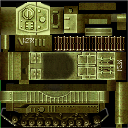 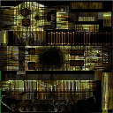

The dominant color is warm yellow-green olive. The turret/hatch area is unusually pale, and raised fittings have strong light rims. Broad rectangular surfaces fade into darker olive-brown areas. A long repeated strip alternates pale bars and dark gaps; the running gear is much darker than the upper body. Fine stippling keeps the large color fields from looking perfectly smooth.

The destroyed version retains conspicuous yellow-green islands of paint between blackened patches, brown stains, and narrow gray streaks.

### British: gbt2 — panel gradients and small repeating patterns

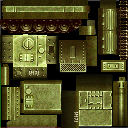 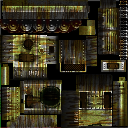

Light olive plate borders enclose darker, softly graded centers. The turret face is strongly highlighted around circular and rectangular fittings. Some larger plates carry a faint diagonal/checkered grain; a small vent-like area uses a much stronger alternating pattern. The wheel strip reduces each wheel to a dark center and a few pale marks.

The destroyed map darkens several panel centers and adds gray-brown streaks around surviving pale edges. Small patterned areas and much of the original construction remain visible.

### British: gbt3 — readable hatches, ribs, and deep shadows

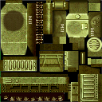 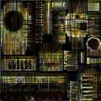

This atlas combines softly shaded olive body panels with very bright hatch faces and repeated ribs. Fine grain is visible across the larger surfaces. A large soft dark circle exists on the intact map. Along the bottom, pale panel edges and sparse tiny dots separate the body from a nearly black wheel band.

The destroyed version deepens dark regions and pulls narrow gray and brown marks across the panels. Its contrast comes from surviving bright construction details beside much darker surrounding paint.

### British: gba1 — cylindrical gradients and economical rivets

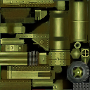 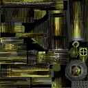

Long rectangular islands contain smooth lengthwise yellow-green highlight stripes, useful references for painting cylindrical parts. Angular plates are quieter olive fields with tiny regularly spaced rivets. Individual rivets often read as a pale spot with a neighboring dark spot. A gray tire with an olive hub gives clear material separation using very few colors.

The destroyed version introduces strong directional black and gray scuff-like bands, brown staining, and interrupted highlights while retaining patches of olive paint and the tire's outline.

### British: gba2 — flat riveted plates and graphic destruction

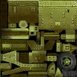 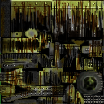

Large flat plates are defined by orderly rivet rows, sparse fittings, fine grain, and gentle shifts between yellow-green and brown-olive. Compared with the camouflaged German examples, the broad fields are simple. The paired bright/dark rivet marks and plate borders do much of the work.

The destroyed texture is especially distinctive: long uneven black, brown, and gray streaks cut through the plates like comb-shaped bands. Some rivets and strips of original color survive. Reproduce this coarse, directional damage pattern rather than substituting a uniform rust texture.

## Destroyed textures: a related but stronger treatment

Across the pairs, destruction is more than an overall brightness reduction. The common ingredients are deep charcoal/black patches, rusty brown discoloration, cooler gray exposed-looking streaks, and remnants of the intact paint. Bright borders often remain next to newly darkened surfaces, making the damage conspicuous at game size.

Many marks are stretched in a common direction within an island. They can look vertical on one patch and horizontal on another because the patches represent differently oriented surfaces. Some are harsh, narrow, and repetitive; others form soft soot-like patches. This is a stylized texture treatment, not evidence that each streak physically follows rain or gravity.

To make a matching variant, preserve the atlas dimensions, island positions, markings where appropriate, and recognizable mechanical features. Layer broad darkening and directional streaks over the intact map, then restore selected gray edges and fragments of paint. Let their strength vary across parts. Exact damage geometry or the original method for producing these streaks cannot be determined from these images alone.

## A practical way to make a similar texture

The following is a proposed workflow, not a reconstruction of the original production history.

1. **Choose the closest reference and final resolution.** Decide the faction, ground/air equipment, material, intact/destroyed state, and intended camera size. For an existing asset, obtain its UV layout and preserve the island positions. An arbitrary attractive atlas will not necessarily fit a model.
2. **Block in the parts.** Establish paint, dark running gear, tires, vents, and any markings. Allocate detail to the surfaces the game camera can actually see. Preview the model before adding grain.
3. **Paint broad form shading.** Use soft brushes or gradients for lighter exposed faces, darker sides, barrel highlights, and contact shadows. Match the strength in the selected reference; do not add a second heavy shadow where one already exists.
4. **Add camouflage or large color variation.** For the German examples, use irregular, softened sandy/green/brown shapes. For the British examples, emphasize variations within warm olive. Keep these patterns subordinate to the shape of the part.
5. **Describe the construction.** Paint plate seams, pale edges, hatch rings, grille bars, and wheel cues. A narrow light line next to a dark line suggests a raised edge. At 128×128, a one-pixel accent or a tiny light/dark pair is a useful starting point, not a requirement for every feature.
6. **Break up the broad surfaces.** Add low-opacity cloudy variation and finer grain, masking their strength by part. A noise layer, a softened texture sample, or hand-painted mottling can provide a starting point. Repaint it until it resembles the references and no longer competes with the fittings.
7. **Add selective wear.** Deepen some recesses and lower areas, vary the paint slightly, and place a few edge accents. Use warmer brown grime on painted parts and subdued gray on tire/metal cues. Leave enough clear paint to retain the faction palette.
8. **Finish at the actual output size.** A larger working canvas can help with gradients, but inspect and retouch the final 128×128 image. Repair disappearing rivets, merged grille bars, and over-soft seams. Do not sharpen the entire noisy surface indiscriminately.
9. **Check the mapped result.** View from the intended RTS camera with representative lighting. Check seams and whether the bright/dark cues still explain the vehicle. Allow appropriate color padding around UV islands so filtering does not pull black background into visible edges. If the target asset uses DXT or another lossy format, inspect the exported result as well.
10. **Derive destruction from the finished intact texture.** Keep its UV correspondence and apply the directional burn/scuff treatment described above. Compare the pair at game size.

Photo fragments, dodge/burn tools, custom brushes, noise layers, and baked shading are all possible aids. None is required by the visual evidence. What matters is the final arrangement of soft color fields, painted volume, clear fittings, restrained grain, and selective high contrast.

## Reusable prompts for an AI art agent

Replace the bracketed fields and attach the chosen reference images. State whether the task is to paint an existing UV layout or to create a texture with a new model; do not let the agent guess that relationship. A style prompt alone cannot ensure that a generated atlas maps correctly.

### Intact ground-vehicle texture

> Create a Blitzkrieg 2-style diffuse/color texture for [vehicle and faction], at [final width × height], using [UV layout/model] and matching [specific texture reference filenames]. Preserve the supplied UV island positions and orientation. Make the vehicle readable from an elevated RTS camera.
>
> Use [reference-matched base paint and camouflage]. Combine softly blended panel shading and low-contrast cloudy/stippled paint variation with selectively crisp mechanical details. Paint broad lighter exposed faces, darker sides, soft contact shadows, pale hatch rims and plate edges, dark seams and vents, sparse bright/dark rivet pairs, and simplified dark wheels with broken light rim marks. Keep the local paint color in the highlights and shadows. Mechanical structure should remain clear through the camouflage.
>
> Keep the surface dusty and used, with selective grime and restrained edge wear. Use detail sizes that survive the final resolution. Match the reference's balance of pale fittings, middle-value paint, and very dark recesses. Evaluate the finished texture on the model and at its native resolution.

Choose one matching color description, rather than combining every faction:

- **German, gt1/gt3/gt4:** dusty sand and gray-brown paint, winding irregular subdued olive-green camouflage with softened boundaries, cream-beige fitting highlights, dark brown-black running gear. Use the selected example to set how pale or muddy the overall finish is.
- **British, gbt1/gbt2/gbt3:** warm mustard-olive/yellow-green paint, pale yellow-green fittings and panel rims, brown-olive shading, fine restrained stippling, and very dark running gear.
- **British, gba1/gba2:** warm olive painted parts, quieter broad plates, orderly tiny bright/dark rivet pairs, lengthwise gradients on cylindrical parts, and charcoal-gray tires.

### Destroyed variant

> Starting from [intact texture], create a destroyed variant matching [destroyed reference filename]. Keep the same image dimensions, UV islands, and recognizable part layout. Add localized near-black soot/burn patches, rusty brown discoloration, and long uneven charcoal and cool-gray streaks aligned with the individual surfaces. Retain selected pale edges, fittings, and fragments of the original faction paint. Match the reference's coarse directional damage at native resolution, with varied intensity across parts.

### Constraints to append when needed

> Avoid photorealistic micro-scratches, mirror-like chrome, wet gloss, dense all-over rust, uniform high-contrast noise, thick cartoon outlines, flat vector fills, deliberately hard-edged retro pixel-art shading, and invented mechanical details that disappear at the target size. Do not place a scene, perspective render, dramatic cast shadow, labels, or a UV wireframe into the deliverable texture. Keep any extra modern material maps separate from this requested color texture.

## Quick review checklist

- At normal game size, are the main surfaces, hatches, wheels, and faction colors recognizable?
- Does the texture contain broad painted volume as well as small details?
- Are the mechanical accents clearer than the grain beneath them?
- Do the colors and camouflage match a particular reference, rather than a generic “WWII weathered metal” description?
- Are there quieter surfaces as well as detailed ones?
- Do the darkest areas make sense on the model, without confusing atlas background or existing shadows with damage?
- Does the destroyed variant preserve the asset's identity and use the reference's directional streaks?
- Does the final mapped/exported texture still work at its actual resolution?
