# Blitzkrieg 2 original 3D art style

Blitzkrieg 2 (BK2) is a 2005 RTS game whose units combine economical geometry with richly described, low-resolution surfaces. The style is slightly exaggerated but mechanically believable: recognizable vehicles, strong separation of parts, earthy colors, and small painted details that remain legible from the game camera.

The 3D models often have roughly 100-1000 polygons.

Textures are usually around 128x128 for common assets like artillery or tanks, going up to 1024x1024 for very large assets like battleships. They look rougly like pixel art in some instances, but with a bit of a step above, given that they're linearly interpolated on the 3D models.
The 3D models in the game only have one color texture on them at a time, there is no special shading like normal or specular maps, just one color texture. Meaning that any shading is basically "pre baked" into the texture, which can be seen below.

## The task scope

You're be given reference pictures or maybe sometimes identical 3D models which you can use for getting the 3D shapes properly. Your task is to make the 3D model (split into multiple shapes, e.g. chasis, turret, main_barrel, tracks, wheels, etc..), configure the UV map and make the textures for it (at least one regular and one destroyed texture, depending on the task). It is necessary that you can do all of that, as base 3D model is useless without a texture. In fact, the hardest part is probably making a good texture that matches the original artstyle, and that's what's needed.

This is aimed to be a long term project, so it'd be ideal if you can develop the "special BK2 art pipeline" or whatever it's called, basically a collection of custom brushes and preconfigured layers or such stuff for painting. So that you can easily make texture camo changes and new textures faster in a more convenient way, instead of making every texture from scratch.

Example of unit 3D model and its textures:

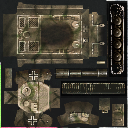 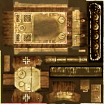 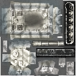

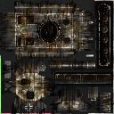 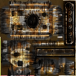 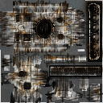

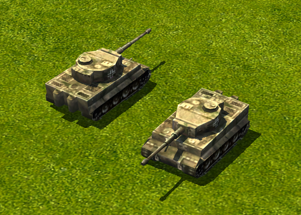

I have limited knowledge about art tools and texture painting, but I'm pretty sure that any good & compentent artist knows what I'm talking about.

## Game factions

Game has multiple factions, each faction has unique, but standardized camouflage looks for its units.

### German units

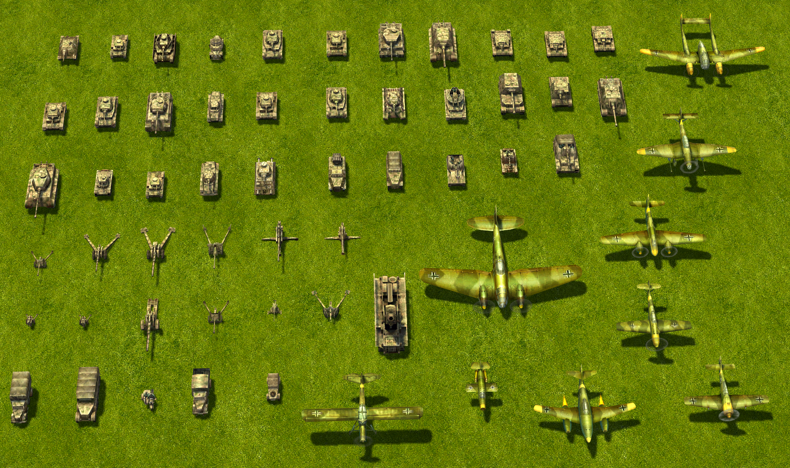

The ground vehicles tend toward dusty beige, gray-brown, and subdued olive camouflage. Pale hatches and plate edges stand out against dark wheels and recesses. Aircraft in this screenshot use greener and browner surfaces, larger wing panels, and bright identification accents; do not automatically transfer the tank camouflage to them.

### British units

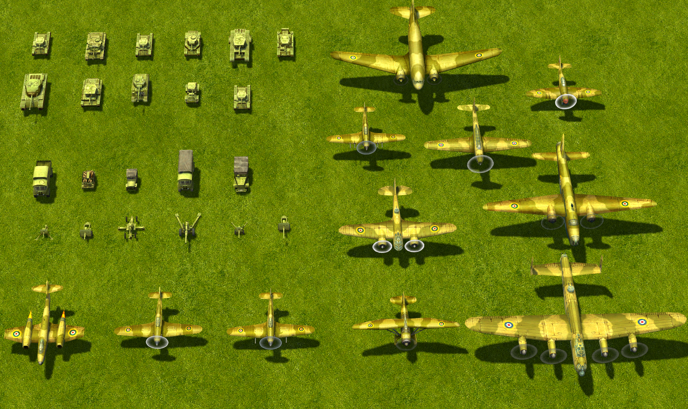

The ground vehicles have a distinctly yellow-green/olive cast, with conspicuously light upper surfaces and fittings. The aircraft read more tan, ochre, and brown-green, with broad camouflage areas and clear roundels. The supplied British ground-equipment textures are particularly useful examples of painted edge highlights.

### Japanese units

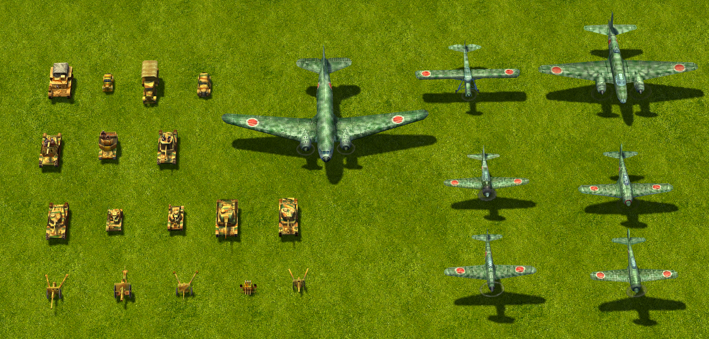

The ground vehicles show warm ochre and brown with contrasting green camouflage. Aircraft have a cooler green-gray appearance and prominent red roundels. This contrast between ground and air units is part of this reference screenshot.

### American units

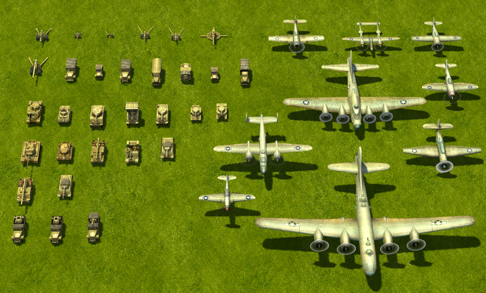

Ground vehicles read as khaki/olive with pale dusty upper details and dark running gear. Many aircraft have light gray or silvery-looking surfaces, restrained panel lines, and clear national markings. Their apparent brightness includes the scene lighting.

### Soviet units

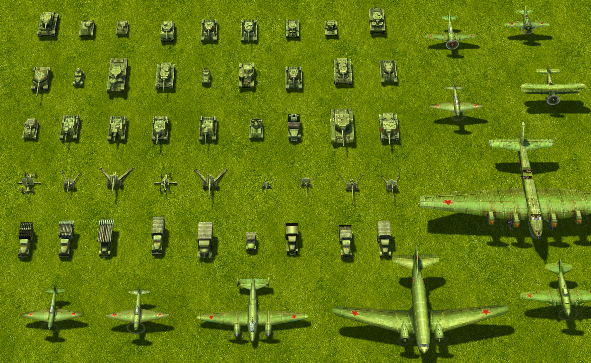

The vehicles read as a more uniform green/olive family, with lighter green fittings and dark undersides. Aircraft also emphasize green, with red stars as strong accents.

## What makes the textures look like BK2

### Soft paint underneath, crisp construction details above

The most useful description is **softly mottled military paint with selectively sharp mechanical accents**. Broad surfaces have blended tonal variation. Hatches, seams, grille bars, wheel rims, rivets, and markings interrupt that softness with small, high-contrast shapes.

There are three useful scales to reproduce:

- **Large:** the base paint/camouflage, lighter upper-facing areas, darker side/underside areas, and broad shadows around major fittings.
- **Medium:** plate borders, hatch rings, straps, vents, wheel faces, and patches of grime. These explain how the vehicle is assembled.
- **Small:** isolated bright/dark pixels, rivet rows, short tread marks, tiny chips, and faint grain. These enrich the larger shapes.

Do not give all three scales equal contrast. A rivet should support a plate, and the plate should support the vehicle's form. A texture made only of tiny scratches will miss the broad shading that gives these examples their volume.

The result can resemble pixel art in its smallest details, but the surfaces also use blended gradients, soft camouflage boundaries, and many intermediate colors. Deliberately reducing everything to hard pixel clusters or a tiny indexed palette would change the look.

### Earthy color, with a clear range of light and dark

The German ground textures combine gray-beige/sand, muddy brown, and subdued green. The British ground textures lean toward mustard olive and yellow-green, with pale yellow-green highlights and brown-olive shadows. Neither family is just a single color with black noise added.

Most painted surfaces stay in the middle of the brightness range, while selected fittings are much lighter and grilles, gaps, and running gear can approach black. Preserve this range: making everything equally muted produces a flat, muddy model. The British examples in particular need their noticeably pale details.

Highlights generally remain related to the local paint color: beige over sandy paint, pale yellow-green over olive, and gray on tire or exposed-metal details. Treat faction colors as relationships to match against a reference, not as one universal hexadecimal color.

### Painted shading that makes small parts read as three-dimensional

Much of the apparent depth is already visible in the flat image:

- **Plate edges and hatches:** a narrow pale edge beside a dark seam suggests thickness or a small bevel. Some edges are softly brightened across several pixels; only the strongest accents need to be sharp.
- **Raised fittings:** a bright face or spot with an adjacent dark mark suggests a bolt, handle, or hinge. At 128×128, a tiny bright/dark pair can communicate more than a carefully drawn miniature bolt.
- **Barrels and other cylinders:** a broad light stripe runs along the length, with darker bands toward the sides. Crosswise bands describe collars or joints. The British *gba1* example shows this especially clearly.
- **Wheels:** a pale partial rim and a few hub marks sit within a dark disk or strip. These are simplified cues, not fully modeled tire diagrams.
- **Contacts and recesses:** soft dark halos or bands around mounted parts make them sit on the surrounding surface. Some intact atlases contain very strong dark patches beneath larger assemblies.

Match the highlight direction to the part as it appears on the model. UV islands can be rotated, so “put the highlight at the top of every rectangle in the atlas” is not a reliable rule. Keep the painted shading broad enough to work alongside the game's lighting. In BK2, textures use bilinear scaling.

### Uneven surfaces, without covering everything in damage

The intact examples have dusty, slightly speckled, sometimes cloudy surfaces. The German examples show subdued mottling within and across camouflage colors. Several British plates have a fine stippled or faintly crosshatched appearance. The images alone do not reveal how much of that fine pattern came from painting, resizing, or texture processing.

A useful reconstruction is a gently varied base color, broad low-contrast cloudy patches, and finer restrained grain. Let this variation sit beneath the mechanical details. Keep some panels comparatively quiet, especially around important rivet rows and markings.

Wear is selective. Darker buildup near recesses and lower parts, faded patches on broad surfaces, and a few pale edge marks are more characteristic of the intact references than dense bright scratch networks. Avoid treating every pale edge as exposed bare metal; many are simply painted form highlights.

## Annotated texture examples

Each pair shows the **intact texture first** and its **destroyed variant second**. Descriptions refer to the flat images; filenames are used as reference identifiers rather than as claims about a specific vehicle model.

### German: gt1 — subdued camouflage and dense fittings

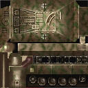   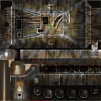

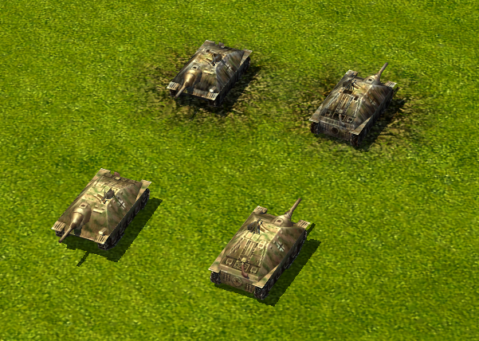

The base is dark, muddy beige-brown with low-contrast olive camouflage. The upper plate carries dense cream-colored hatch borders, grille marks, and small fittings. The wheel row sits in a nearly black band; each wheel gets only a few pale rim/hub marks. Soft halos around the fittings make the otherwise flat plate appear raised and worn.

The destroyed version keeps the layout and much of the camouflage, adding gray edge streaks, blackened bands, and brown discoloration. It becomes darker and more vertically streaked across several large islands.

### German: gt2 — higher-resolution reference for the same ideas

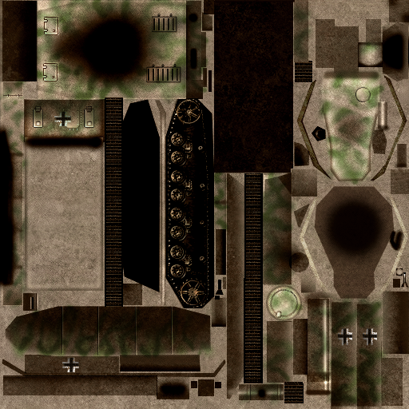   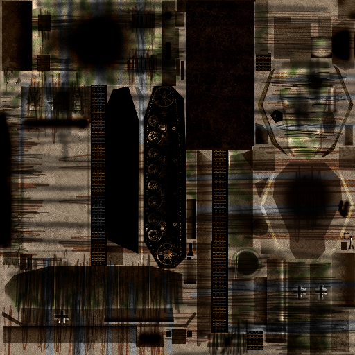

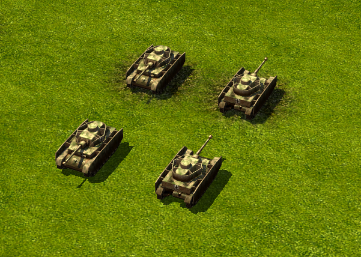

This pair is 512×512. It reveals fine sandy grain, subdued green camouflage, thin outlined panels, small grille slots, and more detailed wheel hubs. Some broad faces are comparatively plain and gray-beige. Strong soft black patches are already present on the intact map, so they must not all be interpreted as destruction.

The destroyed map adds long dark, brown, and gray streaks across panels while retaining their basic arrangement. Use this pair to study layering, but do not require its fine detail density from a 128×128 atlas.

### German: gt3 — pale dusty paint and looping green camouflage

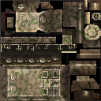   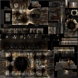

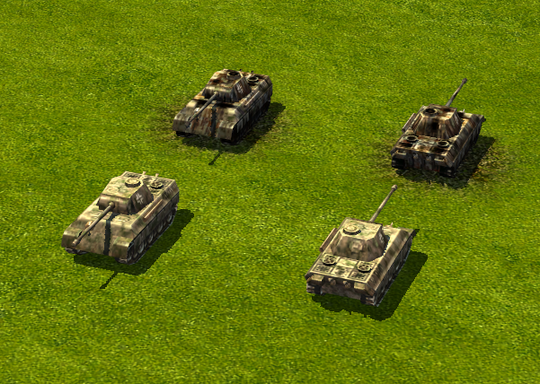

Pale gray-beige plates are crossed by soft, irregular green loops and bands. Rectangular grilles use small dark/light grids. Hatch rims and boundaries are much sharper than the camouflage. A broad shadowed wheel strip provides a dark base beneath the lighter bodywork.

The destroyed map introduces near-black patches at several fittings, darkened wheel areas, brown burn discoloration, and pale gray streaks extending from panel boundaries. The remaining pale camouflage fragments keep it related to the intact version.

### German: gt4 — strong plate edges and simple wheel symbols

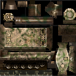   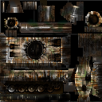

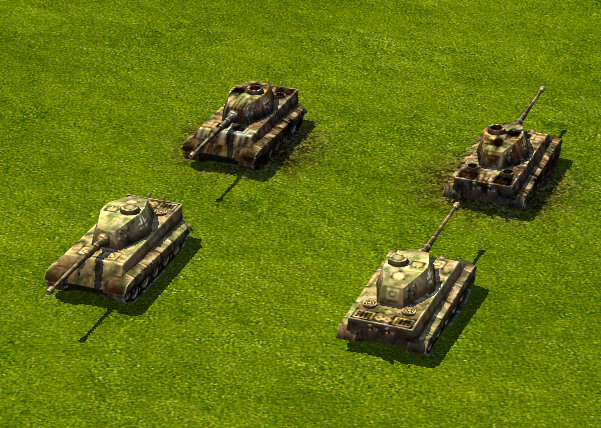

The sandy finish and winding olive camouflage are similar to *gt3*. Large plates have soft internal shading and selectively bright borders. Small circular parts use pale rings around muted centers. The wheel row is reduced to dark disks with light, broken arcs rather than complete high-detail circles.

The destroyed texture emphasizes black circular areas, gray-white scraped-looking bands, and rusty brown streaks. Several light panel edges survive, keeping the vehicle's construction readable through the darkening.

### British: gbt1 — bright hatch rims over warm olive paint

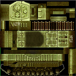   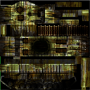

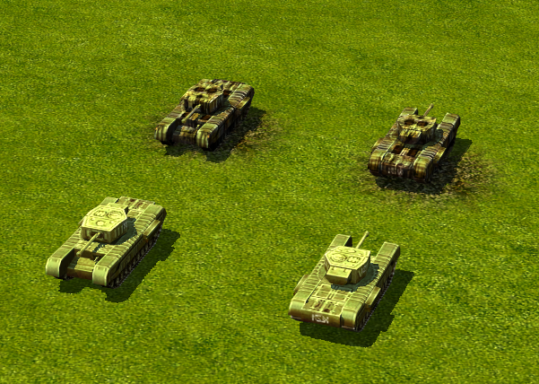

The dominant color is warm yellow-green olive. The turret/hatch area is unusually pale, and raised fittings have strong light rims. Broad rectangular surfaces fade into darker olive-brown areas. A long repeated strip alternates pale bars and dark gaps; the running gear is much darker than the upper body. Fine stippling keeps the large color fields from looking perfectly smooth.

The destroyed version retains conspicuous yellow-green islands of paint between blackened patches, brown stains, and narrow gray streaks.

### British: gbt2 — panel gradients and small repeating patterns

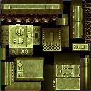   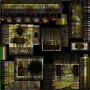

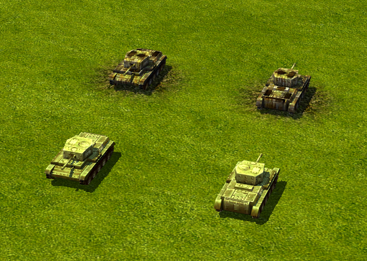

Light olive plate borders enclose darker, softly graded centers. The turret face is strongly highlighted around circular and rectangular fittings. Some larger plates carry a faint diagonal/checkered grain; a small vent-like area uses a much stronger alternating pattern. The wheel strip reduces each wheel to a dark center and a few pale marks.

The destroyed map darkens several panel centers and adds gray-brown streaks around surviving pale edges. Small patterned areas and much of the original construction remain visible.

### British: gbt3 — readable hatches, ribs, and deep shadows

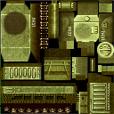   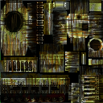

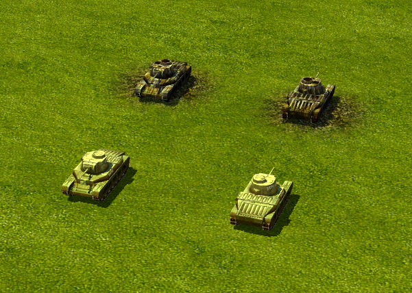

This atlas combines softly shaded olive body panels with very bright hatch faces and repeated ribs. Fine grain is visible across the larger surfaces. A large soft dark circle exists on the intact map. Along the bottom, pale panel edges and sparse tiny dots separate the body from a nearly black wheel band.

The destroyed version deepens dark regions and pulls narrow gray and brown marks across the panels. Its contrast comes from surviving bright construction details beside much darker surrounding paint.

### British: gba1 — cylindrical gradients and economical rivets

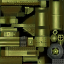   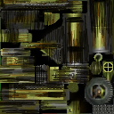

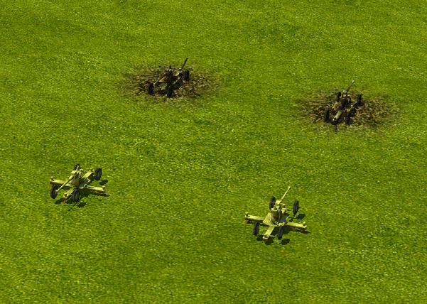

Long rectangular islands contain smooth lengthwise yellow-green highlight stripes, useful references for painting cylindrical parts. Angular plates are quieter olive fields with tiny regularly spaced rivets. Individual rivets often read as a pale spot with a neighboring dark spot. A gray tire with an olive hub gives clear material separation using very few colors.

The destroyed version introduces strong directional black and gray scuff-like bands, brown staining, and interrupted highlights while retaining patches of olive paint and the tire's outline.

### British: gba2 — flat riveted plates and graphic destruction

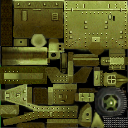   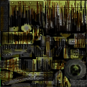

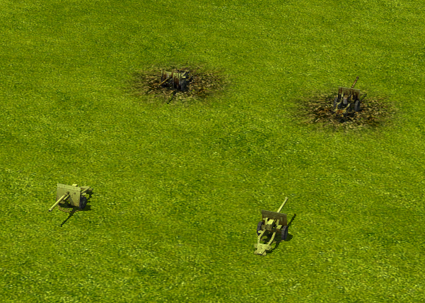

Large flat plates are defined by orderly rivet rows, sparse fittings, fine grain, and gentle shifts between yellow-green and brown-olive. Compared with the camouflaged German examples, the broad fields are simple. The paired bright/dark rivet marks and plate borders do much of the work.

The destroyed texture is especially distinctive: long uneven black, brown, and gray streaks cut through the plates like comb-shaped bands. Some rivets and strips of original color survive. Reproduce this coarse, directional damage pattern rather than substituting a uniform rust texture.

## Destroyed textures: a related but stronger treatment

Across the pairs, destruction is more than an overall brightness reduction. The common ingredients are deep charcoal/black patches, rusty brown discoloration, cooler gray exposed-looking streaks, and remnants of the intact paint. Bright borders often remain next to newly darkened surfaces, making the damage conspicuous at game size.

Many marks are stretched in a common direction within an island. They can look vertical on one patch and horizontal on another because the patches represent differently oriented surfaces. Some are harsh, narrow, and repetitive; others form soft soot-like patches. This is a stylized texture treatment, not evidence that each streak physically follows rain or gravity.

To make a matching variant, preserve the atlas dimensions, island positions, markings where appropriate, and recognizable mechanical features. Layer broad darkening and directional streaks over the intact map, then restore selected gray edges and fragments of paint. Let their strength vary across parts. Exact damage geometry or the original method for producing these streaks cannot be determined from these images alone.
